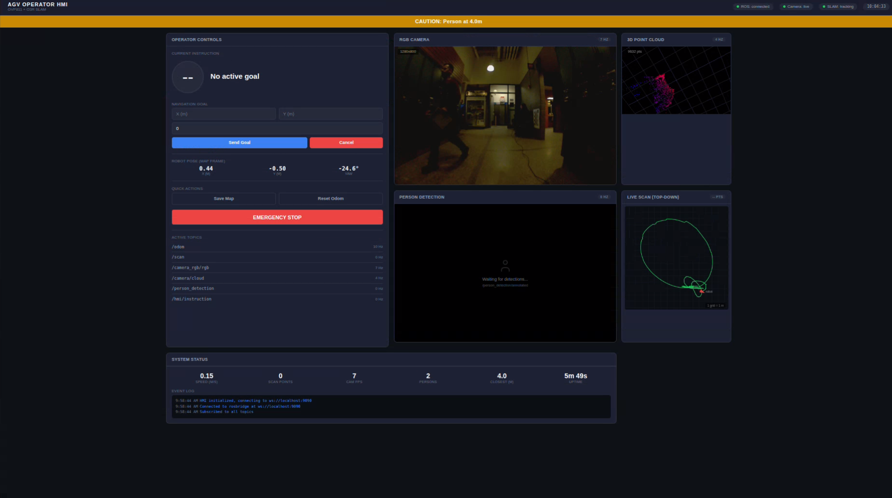

# path2auto_vis-slam

**Autonomous Guided Vehicle (AGV) navigation stack built on the IFM O3R OVP811.**

Visual SLAM + sensor fusion + Nav2 path planning, with a browser-based operator HMI and real-time person detection.

---

## HMI



The browser HMI runs at `http://localhost:8080` and connects to ROS2 via rosbridge on port 9090. It provides:

- Live RGB camera feed and 3D point cloud visualisation
- Real-time person detection with proximity alerts (Caution / Warning / Danger zones)
- Top-down live scan view from the ToF camera
- Navigation goal input (X/Y in map frame) with Send / Cancel controls
- Robot pose readout (X, Y, Yaw)
- Quick actions: Save Map, Reset Odometry, Emergency Stop
- Active topic monitor with per-topic Hz readout
- System status bar: speed, scan points, camera FPS, persons detected, closest person distance, uptime
- Event log

---

## Hardware

| Component | Detail |
|-----------|--------|
| Compute + camera unit | IFM O3R OVP811 |
| 3D ToF head | O3R225, port0, PCIC 50010 |
| RGB head | O3R225, port2, PCIC 50012 |
| IMU | IIM42652 (onboard), port6, PCIC 50016 |
| Device IP | `10.167.53.27` |
| ROS2 distro | Jazzy |

---

## Packages

| Package | Description |
|---------|-------------|
| `agv_description` | Robot URDF and TF frame tree |
| `agv_navigation` | Primary nav stack: RTAB-Map SLAM + EKF + Nav2 |
| `agv_navigation_orbslam` | Alternative RGBD SLAM stack using ORB-SLAM3 (not production-ready) |
| `agv_hmi` | Turn-by-turn instruction node + browser HMI frontend |
| `agv_imu` | OVP811 port6 IMU publisher (IIM42652, ~1 kHz) |
| `agv_person_detection` | YOLOv8n person detector with ToF depth proximity zones |

External drivers (`ifm3d-ros2`, `orb_slam3_ros2`) are not included — see Dependencies.

---

## System Architecture

```
OVP811 (10.167.53.27)
  ├── port0 (ToF)  → ifm3d camera_node → /ifm3d/camera/cloud
  ├── port2 (RGB)  → ifm3d camera_node → /ifm3d/camera/rgb_2d
  └── port6 (IMU)  → agv_imu          → /imu/data

/ifm3d/camera/cloud → icp_odometry → /odom_icp ──┐
/imu/data ──────────────────────────────────────  ├→ EKF → /odom
                                                  └──────────────┘

/ifm3d/camera/cloud + /odom → RTAB-Map → /rtabmap/grid_map
/ifm3d/camera/cloud → pointcloud_to_laserscan → /scan

/scan + /odom → Nav2 (AMCL + planner + costmap)
/ifm3d/camera/rgb_2d → YOLOv8n + ToF depth → /person_detection/proximity

Nav2 path → instruction_node → /hmi/instruction (turn-by-turn JSON)
rosbridge (:9090) ← browser HMI (http://localhost:8080)
```

---

## Startup

See [OPERATOR_GUIDE.md](OPERATOR_GUIDE.md) for the full step-by-step startup sequence.

**Quick summary — run each in a separate terminal (source workspace first):**

```bash
source ~/colcon_ws/install/setup.bash
```

| # | Terminal | Command |
|---|----------|---------|
| 1 | Camera | `ros2 run ifm3d_ros2 camera_standalone --ros-args --namespace ifm3d --name camera --params-file ~/colcon_ws/src/ifm3d-ros2/config/camera_default_parameters.yaml` |
| 2 | Robot description | `ros2 run robot_state_publisher robot_state_publisher` |
| 3 | IMU | `ros2 run agv_imu imu_publisher --ros-args --name imu_publisher -p ip:=10.167.53.27 -p pcic_port:=50016 -p frame_id:=imu_link` |
| 4 | ICP odometry | `ros2 run rtabmap_odom icp_odometry --ros-args --params-file ~/colcon_ws/src/agv_navigation/config/icp_odometry.yaml --remap scan_cloud:=/ifm3d/camera/cloud --remap odom:=/odom_icp` |
| 5 | EKF | `ros2 run robot_localization ekf_node --ros-args --params-file ~/colcon_ws/src/agv_navigation/config/ekf_params.yaml --remap odometry/filtered:=/odom` |
| 6 | RTAB-Map SLAM | `ros2 run rtabmap_slam rtabmap --ros-args --params-file ~/colcon_ws/src/agv_navigation/config/rtabmap.yaml --remap scan_cloud:=/ifm3d/camera/cloud --remap odom:=/odom` |
| 7 | LaserScan | `ros2 run pointcloud_to_laserscan pointcloud_to_laserscan_node --ros-args --params-file ~/colcon_ws/src/agv_navigation/config/pointcloud_to_laserscan.yaml --remap cloud_in:=/ifm3d/camera/cloud --remap scan:=/scan` |
| 8 | Nav2 | `ros2 launch agv_navigation nav2_localization.launch.py map:=~/maps/agv_map.yaml` |
| 9 | rosbridge | `ros2 run rosbridge_server rosbridge_websocket --ros-args -p port:=9090` |
| 10 | HMI server | `python3 -m http.server 8080 --directory ~/colcon_ws/src/agv_hmi/hmi` |
| 11 | HMI node | `ros2 run agv_hmi instruction_node --ros-args --name instruction_node` |
| 12 | Person detection | `ros2 run agv_person_detection person_detector --ros-args --params-file ~/colcon_ws/src/agv_person_detection/config/person_detection.yaml` |

---

## Known Limitations

- **No wheel odometry** — localisation relies entirely on ICP point cloud odometry from the ToF camera. Degrades in feature-poor environments (blank walls, open floors). See the technical assessment in [HANDOVER.md](HANDOVER.md).
- **ORB-SLAM3 pipeline** (`agv_navigation_orbslam`) uses placeholder camera intrinsics — not suitable for real use without extracting calibration from `/ifm3d/camera/camera_info`.
- **Camera TF offsets** in the URDF are set to zero pending physical measurement and MCC calibration.
- **IMU disabled in ICP odometry** (`subscribe_imu: false`) due to an unresolved port6 PCIC timing issue.
- Max reliable operating speed ~0.5 m/s (ICP constraint). Nav2 is configured to 0.2 m/s.

---

## Dependencies

**ROS2 packages:**
```bash
sudo apt install ros-jazzy-rtabmap-ros ros-jazzy-navigation2 ros-jazzy-nav2-bringup \
  ros-jazzy-robot-localization ros-jazzy-rosbridge-suite \
  ros-jazzy-pointcloud-to-laserscan ros-jazzy-robot-state-publisher
```

**ifm3d C++ library:**
Install from `.deb` before building:
```bash
sudo dpkg -i ifm3d-ubuntu-24.04-amd64-1.6.12.deb
```

**ifm3d-ros2 driver** (clone into `src/`):
```bash
git clone https://github.com/ifm/ifm3d-ros2.git --branch v1.1.0
```

**Python:**
```bash
pip install ultralytics
```

**Build:**
```bash
source /opt/ros/jazzy/setup.bash
cd ~/colcon_ws
colcon build --symlink-install
source install/setup.bash
```

---

## Documentation

- [OPERATOR_GUIDE.md](OPERATOR_GUIDE.md) — step-by-step startup, troubleshooting, topic checklist
- [HANDOVER.md](HANDOVER.md) — full technical handover for new developers
